# Wholesale-Tea-Price-Prediction
Wholesale tea auction prices prediction

## Predicting wholesale tea auction prices at Tea Board of India Auctions - a work-in-progress

### Background

This project came to my attention through a friend who works as a consultant for a tea auctioneering company based in Cochin in Southern India. He asked whether I could help to build models to predict auction prices at weekly tea auctions.

Tea is a huge market around the world, and India is a leading producer. About 1.4 million kgs of tea were produced in India in 2019.
Considering the complex logistics involved before the tea reaches the consumer, good predictive models would be very useful for all parties involved in the tea auction trade for some of the following reasons:

- **For Sellers (Tea Estates):** 
    The question is what quantity to put up for any given weekly auction at any one of 6 auction centers around the country run by the Tea Board of India. 
    The tea must be despatched to the auction center **2 to 3 weeks prior to the date of the auction.** 
    Typically, there are 2 or 3 auction centers that are within reach of trucks within that time span and the seller must decide where to send how much.

- **For Buyers (Tea Packeteers):**
    Big packeteers store upto 2 to 2 and a half months of stock at any given point in time, and hence must plan their buying & blending ahead of time.
    Exporters take a lot of time to fulfil their large orders and have to quote prices in advance to importers.
    
- **For Auctioneers:**
   Auctioneers need give market feedback and intelligence reports to buyers and sellers. My friend believes that the quality of the reports that he would be able
   to offer would be greatly enhanced with good predictive analytics. Currently, he said, all they offer is based on intuition! See the last page of the attached 
   report.

The **4 major types** of teagrown in India are:
- **CTC** (Crush, tear, curl: ensures a faster production of a standard quality)
- **Orthodox** (focuses on preserving the singular virtues of the leaf resulting in fermented tea leaves)

THe above are further divided into"
- **Leaf** (the better quality leaves and curl), and
- **Dust** (the dust and fannings leftover from broken tea leaves, so in essence - the waste)

Tea buyers and sellers always have a rolling stock of tea at any point in time. Even though tea is perishable it is stored upto 9 months. Both buyers and sellers accumulate stocks over time as the market dictates(demand/supply shocks). 
Tea supply and tea quality are both very unpredictable and are heavily dependent on regional weather patterns. 

As far as is currently known, Hindustan Unilever Limited (as a tea packeteer) is the only company in India that is performing sophisticated predictive analytics internally, using not only historical data about:
- offer quantities
- sold quantities
- average prices

but also has incorporated other features like:
- quality indices
- market feedback on quality
- the consumer price index
- ... and more...

## The Goals of this Project:

- To build a continuosly updated predictive analytics pipleline accessible to buyers, sellers and auctioneers in the Tea Auction market in India
- This repo represents the initial exploratory work that has been done towards this goal

## The Process

- Data: Get and clean data
- EDA: Explore and analyze the data
- Score: Set a metric to evaluate the models
- Base model: Iterate through various model options to find the best base model
- Tune Model: Search for the best hyperparameters
- Start with a limited scope and iteratively expand the features that will be used
    - Limit the types of tea to the 4 majors, then incorporate the other categories
    - Limit the auction centers, start with 1 in S, India, then include the others in S. India. THen move to N. India centers (where the patterns are different)
    - Start with univariate time series models (price only), then move to multivariate models with quantity features added, then incorporate multiple categories,
      then include multiple bnear-located auction centers (S. India, N. India separately)

## The Data

- Data Source:
  [Tea Board of India](https://www.teaauction.gov.in/pages/News.aspx)
  
- Description of Data: 
  - **Weekly data from 2012 until the present on the following features:**
    - Offered Quantities
    - Sold Qualtities
    - Average Price
    
    for ...
    
    **10 types of tea**
    - CTC Leaf
    - CTC Dust
    - Ortho Leaf
    - Ortho Dust
    - Kangra Leaf
    - Kangra Dust
    - Darj Leaf
    - Darj Dust
    - Green Leaf
    - Green Dust
    
    **across 7 auction centers in India**
    - Cochin
    - Coimbatore
    - Coonoor
        ... in Southern India, and
    - Kolkata
    - Guwahati
    - Jalpaiguri
    - Siliguri
        ... in Northern India
    
    This repo is currently (22 September 2020) limited to the work on:
    - Data starting from 2012 (prior years' data had different aggregations of tea types)
    - The 4 major tea types only (CTC Leaf, CTC Dust, Ortho Leaf, Ortho Dust)
    - Only 1 South Indian auction center (Cochin)
    - North Indian auction centers were left aside for now. NOTE: North Indian tea supply has a very different seasonality from South Indian tea supply due to the 
      fact that South Indian tea grows in an equatorial climate and is plucked all year round

- Data Cleaning
  By checking for outliers and missing data, it was found that:
    - Some of the data (especially form the early years) appears to have involved manual data entry as there were obviuos human errors in the data (for example, 
      2 consecutive cells on the the samae row had the same values even though one was quantity in Kgs - in the order of 10s of thousands, and the other was price
      per Kg - in the order of INR 70 to INR 110)
    - A small percentage (<2%) of NaNs and Zero values were present
      These were substituted with moving averages from the the past 3 observations(weeks)
    
## EDA

- Overall available data points = 448
- Quantities offered, sold and average price for the Cochin Auction Center from 2012 to the end of 2019 were as follows:

  CTC Leaf:
 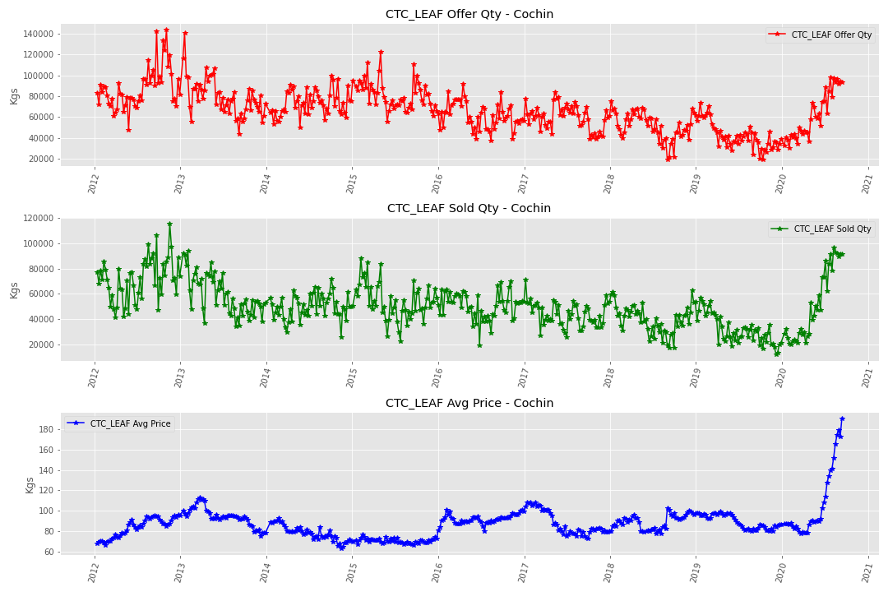

  CTC Dust:
 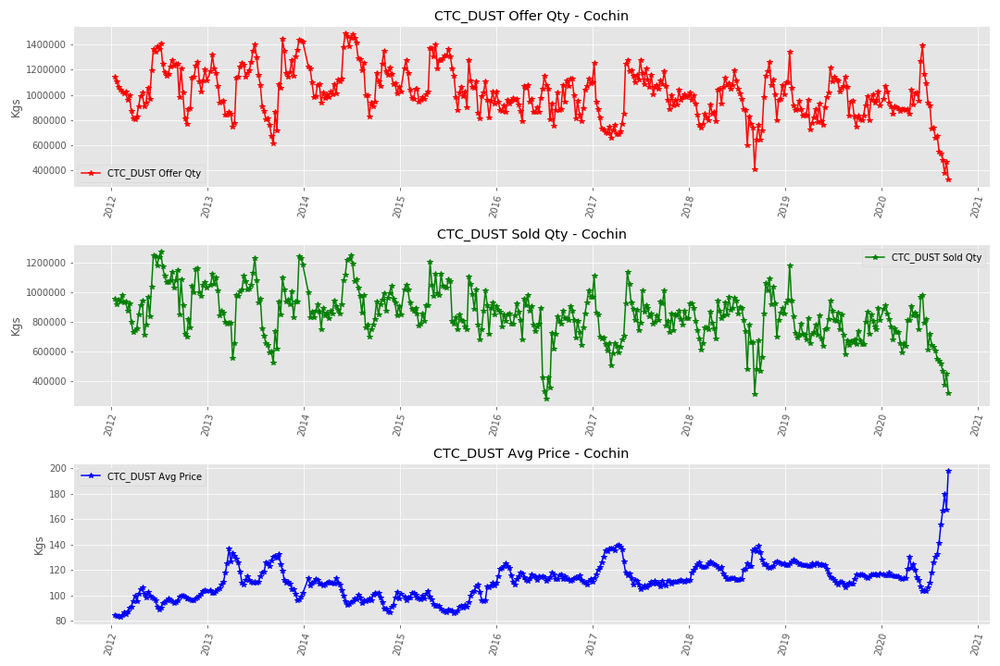
 
  Ortho Leaf:
 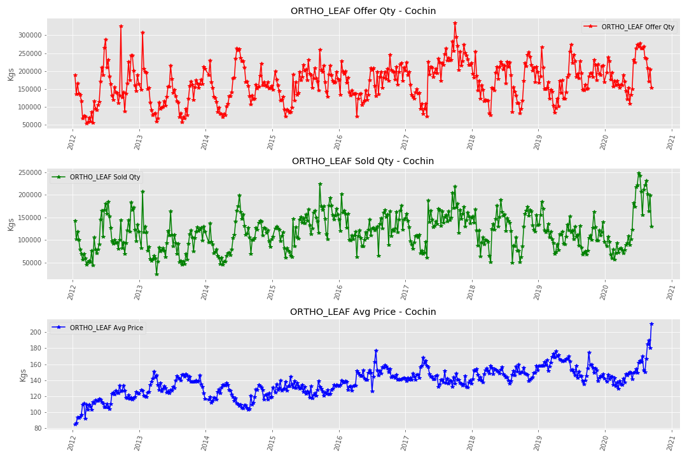
    
  Ortho Dust:
 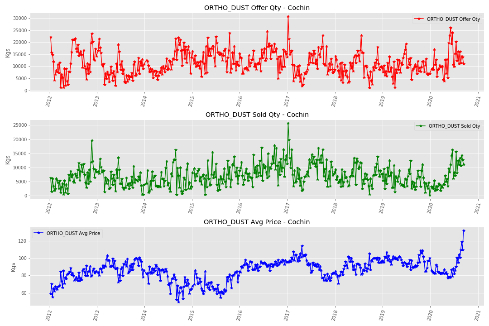
 
- Due to the anomalous nature of 2020 in general, and also borne out by steep rises and declines not seen in any previous years in the data, 
  2020 data was then excluded in this initial phase of the project
 
## Model Scoring

MAPE: Mean Absolute Percentage Error was chosem as the model metric

## ARIMA/SARIMAX Models

The methodology followed for producing an ARIMA model is summarized in the following flowchart, taken from Hyndmann.

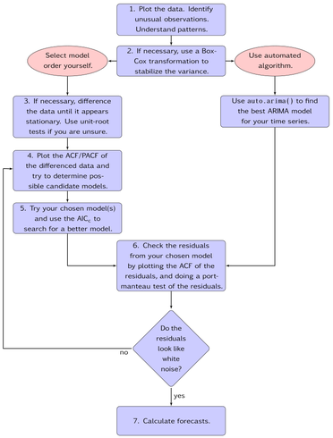

- Since no obvious annual seasonality was observed, I started with:

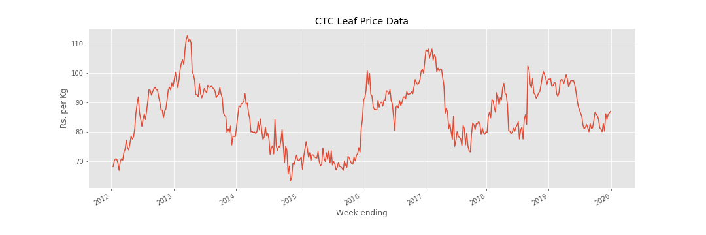

- Since no obvious annual seasonality was observed, I started with:

    - **Univariate ARIMA model**
    
    Data is non-stationary (ADF p-value = 0.23022144267525432)
    
    Did First differencing
    
    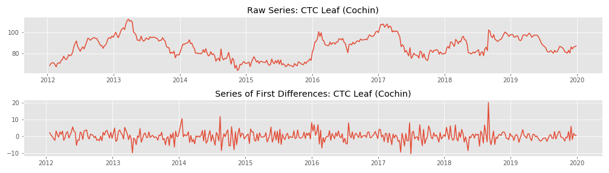
    
    Checked for stationarity (ADFuller Test)
    ADF p-value for differenced price series: 0.00
    
    Concluded that I can proceed with ARIMA
    
    Looked at the auto and partial auto correlation plotsto determine the correct order for the AR and MA models
    
    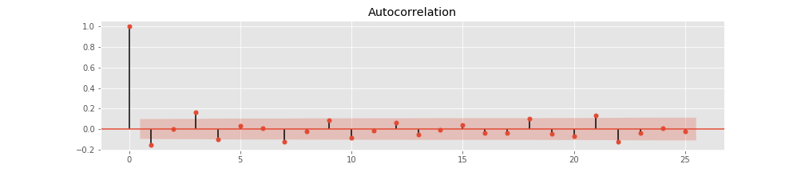
    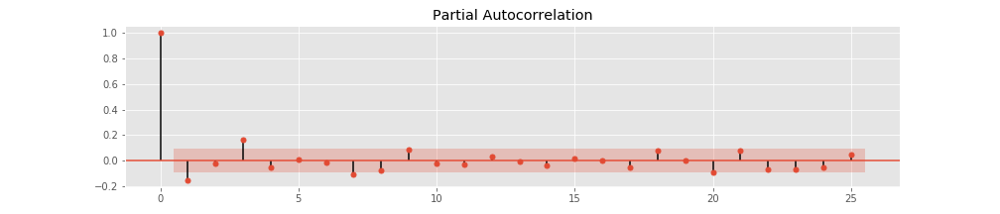
    Since one differencing achieved stationarity, this suggested that the original series should be modeled as an  𝐴𝑅𝐼𝑀𝐴(1,1,1) 
    
    However, this gave poor results: AIC = 2090.626
    
    NOTE: A nonseasonal ARIMA model is classified as an "ARIMA(p,d,q)" model, where: 
          p is the number of autoregressive terms, 
          d is the number of nonseasonal differences needed for stationarity, and. 
          q is the number of lagged forecast errors in the prediction equation.
          
    Tried other p, d, q values as follows:
    - 'AR': 2, 'MA': 0,
    - 'AR': 2, 'MA': 1,
    - 'AR': 1, 'MA': 0,
    - 'AR': 1, 'MA': 1,
    - 'AR': 3, 'MA': 0,
    - 'AR': 3, 'MA': 1
    
    Results obtained were:
    - ARIMA(2, 1, 0) AIC: 2090.478012840021
    - ARIMA(2, 1, 1) AIC: 2086.769481885772
    - ARIMA(1, 1, 0) AIC: 2088.6958921646024
    - ARIMA(1, 1, 1) AIC: 2090.625790904691
    - ARIMA(3, 1, 0) AIC: 2081.4707156798445
    - ARIMA(3, 1, 1) AIC: 2082.3967226022946
    
    Then went to seasonal ARIMA (SARIMA)
    
    
    Tried stepwise **Auto Arima** search and observed result as follows:
    
    - SARIMAX (0,1,1)(2,1,0)[52] with a seasonality of  52 weeks: AIC = 1940.700  MAPE =  9.4475
    - SARIMAX(2,1,2)(2,1,0)[104] with a seasonality of 104 weeks: AIC = 1662.785  MAPE =  8.5770
    - SARIMAX(0,1,1)(1,1,0)[156] with a seasonality of 156 weeks: AIC = 1426.932  MAPE = 13.7874
      
   
    [52](2,1,0).png)
    
    [104](2,1,0).png)
    
    [156](1,1,0).png)
    
    
    Checked the best model's residuals to make sure that the variability looks like white noise:
    [104](2,1,0).png)
    
    
    And checked for correlations:
    [104](2,1,0).png)

    Future predictions (into the first weeks of 2020 ... remember that we decided to only use data up to 2019, but we do have 2020 data)
    
    
    Prediction results were:
    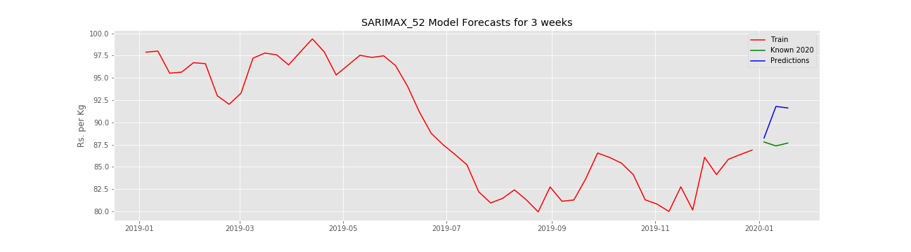
    SARIMAX(52 weeks seasonality) MAPE for 3 weeks prediction = 3.3547
    
    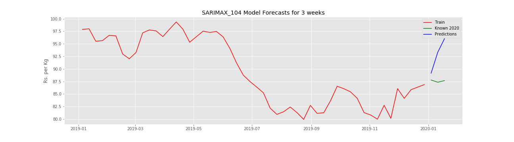
    SARIMAX(104 weeks seasonality) MAPE for 3 weeks prediction = 5.9720
    
    
    SARIMAX(156 weeks seasonality) MAPE for 3 weeks prediction = 4.8335
    
   
   ## LSTM Models

   **Univariate LSTM Model**
   - keras.Sequential()
   - keras.layers.LSTM(...)
   - keras.layers.Dropout(0.1)
   - keras.layers.LSTM(...)
   - keras.layers.Dense(1, activation='relu')) 
   - compile(optimizer='adam', loss='mape')
   
   Model was fit with 500 Epochs brought loss funtion (MAPE) down to: 3.1887
   
   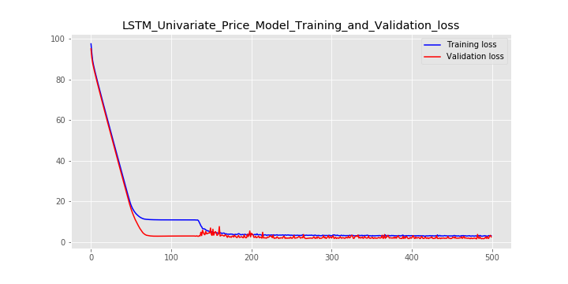
   Looking at MAPE over the test data (about 30% of total data)
   
   

   MAPE for known data (before 2020) = 10.994293417050645
   
   **Multivariate LSTM Model**
   Includes features: Offer Quantity, Sold Quantity and Price
   
  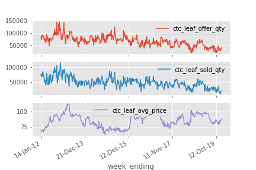
   
   
   **Multivariate Single-step output Model**
   keras.Sequential()
   keras.layers.LSTM(...)
   keras.layers.Dropout(0.1))
   keras.layers.LSTM(...)
   keras.layers.Dense(1))
   
   Model was fit with 500 Epochs brought loss funtion (MAPE) down to: 2.5002

   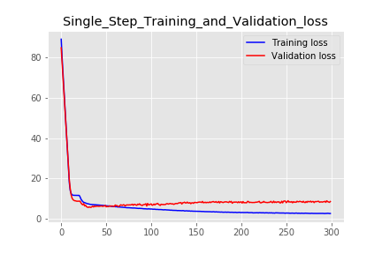
   
   Some sample predictions:
   
   
   
   **Multivariate Multi-step output Model**
   For 3 weeks ahead forecasting
   
   - keras.Sequential()
   - keras.layers.LSTM(...)
   - keras.layers.Dropout(0.1))
   - keras.layers.LSTM(...)
   - keras.layers.Dense(3))
   - compile(optimizer='adam', loss='mape')
   
   Model was fit with 300 Epochs brought loss funtion (MAPE) down to: 11.3240

   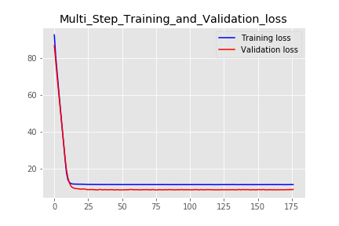
   
   Some sample predictions:
   
   
 
   
## Next Steps
- Try multivariate SARIMAX 
- Try Hot Winters
- Try LSTM with more features
  - Add price, offer quantity and price quantity data for all 4 tea categories
  - Add other South Indian Auction Center Data
- Repeat the entire analysis for North Indian Auction Centers
- Create an automatic pipeline from Tea Board published data into this application
- Create automated delivery of predictions (via Flask)
